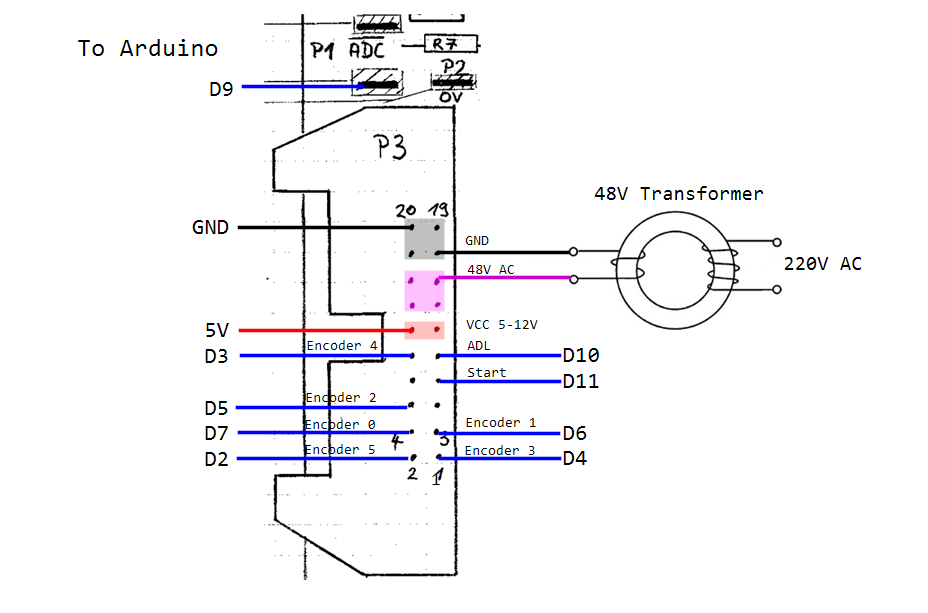

# Fallblatanzeige (split flap)
We got our hands on some old split flap displays at the 34c3 and started to reverse engineer and develop our own control of the displays.

The main hurdle is that they require 48V AC for the synchronous motor that drives the mechanism. But although finding a 48V AC transformer is quite hard, there are many dual 24V transformers out there that can be used.

## Wiring

Don't forget to also connect ADC which is above the pin header.

## Quirks
Reading the encoder is quite difficult. Looking into the [schematic](documentation/Alter_Print_Schema.pdf), it is only possible when the motor is not running and ADL and ADC are low.

But even when I tried it like described in the original timing diagram, the encoder would not always deliver correct values.

I resorted to simply polling the encoder very often and ignoring the false readings. There is probably a better way to get the data, but I could not figure it out yet.

## Chaining displays
To drive multiple displays with one microcontroller one would simply have to connect the displays in one line with 20 pin ribbon cables (ADL selects the line) horizontally and connect the ADC pins of each coloumn vertically.  
At the end of each line every pin is parallel with the other lines except the respective ADL lines.

This was not tested yet and is currently not implemented in the code.